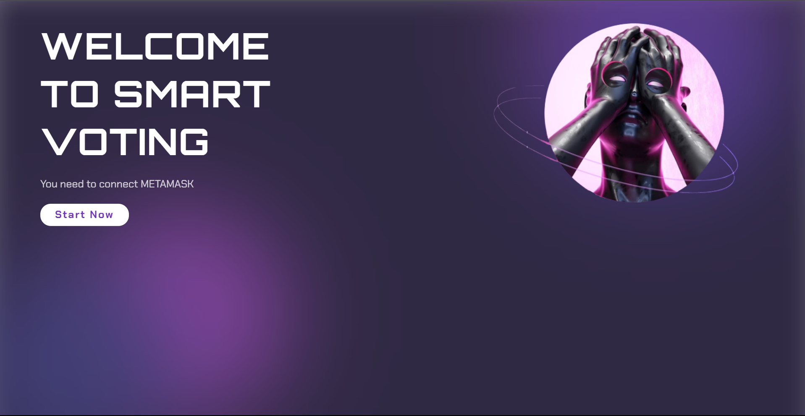
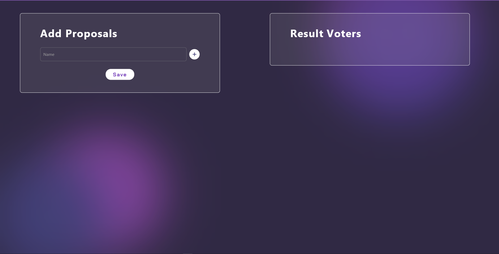
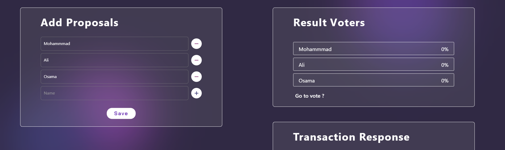
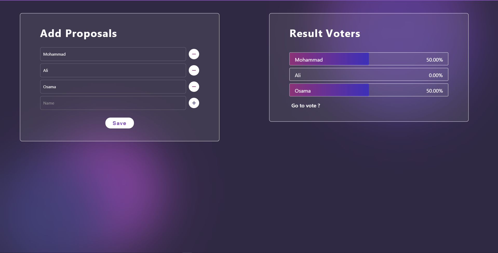
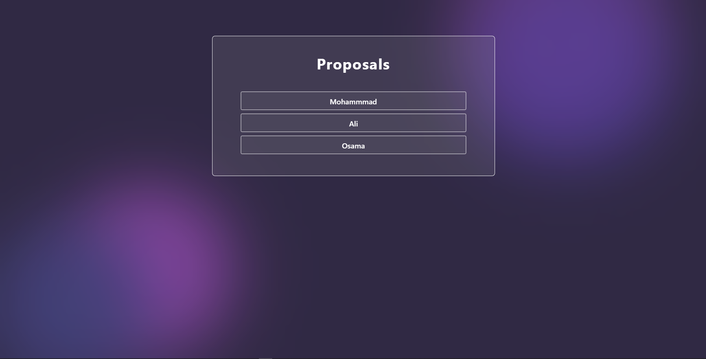
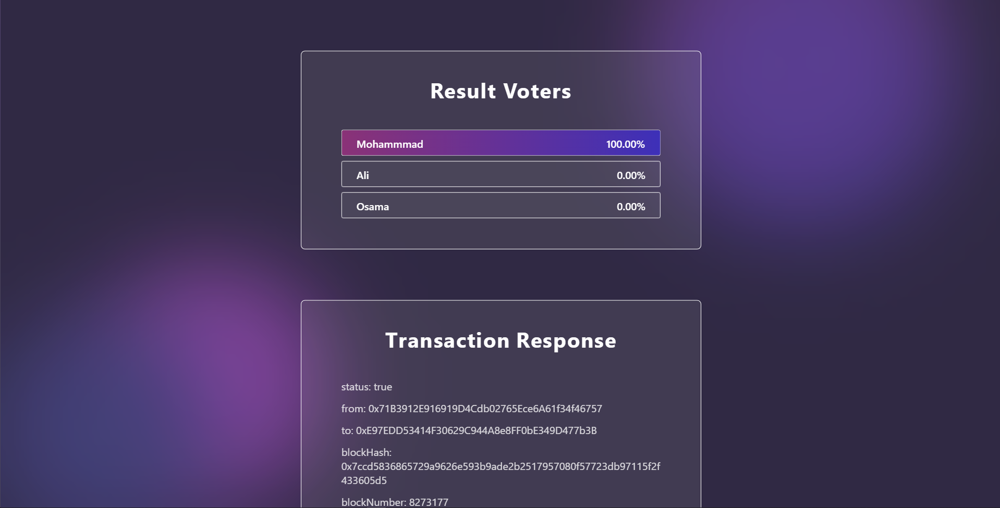
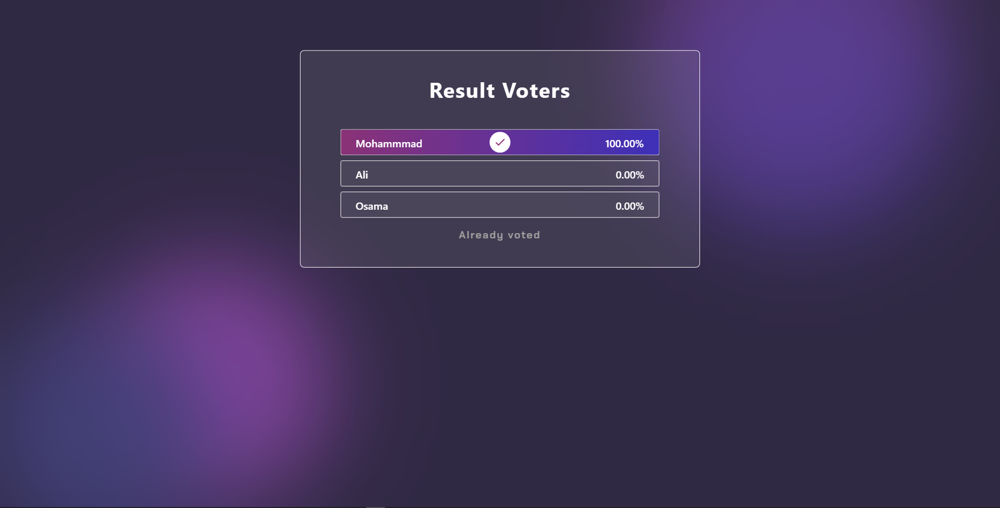

# SMART VOING


### Simple project use web3 with Flutter
### example Smart Voting with a control panel

<br>

---

<br>

## Development Setup
Clone the repository and run the following commands:
```
git clone https://github.com/colonal/flutter_web3_example.git
cd flutter_web3_example
```
### Add  API and Address
1- go to .env file add Address Key
```
ADDRESS_KEY=0xE97ED...
```
2- go to api.dart file add Address Key
```
├── lib
│   └── keys
│       └── api.dart
```
```
String abi = "API"
```

run command
```
flutter pub get
flutter pub run build_runner build --delete-conflicting-outputs
flutter run -d chrome --web-renderer html
```
<br>

---

<br>

## can show Solidity file
```
├── Solidity File
│   └── ballot.sol
```

<br>

---

<br>

 

# ScreenShot


 




